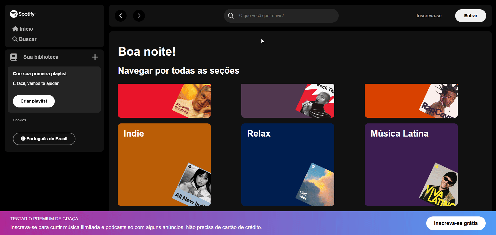

# Clone Spotify

> Um clone da interface do Spotify, desenvolvido com HTML, CSS e JavaScript, para fins educacionais e de prática de desenvolvimento front-end.

Este projeto foi expandido e transformado em uma aplicação mais robusta utilizando React. Você pode acessá-lo em [link].



## Funcionalidades Principais:

- Exibição de playlists e artistas.
- Busca dinâmica por artistas.
- Saudação personalizada com base no horário do dia.
- Interface responsiva e estilizada.

## Tecnologias Utilizadas:

- HTML5
- CSS3
- JavaScript

## Como Executar:

1. Clone o repositório:

   ```bash
   git clone https://github.com/usuario/HTML_CSS_Javascript-PaginaSpotify.git
   ```

2. Navegue até o diretório do projeto:

   ```bash
   cd HTML_CSS_Javascript-PaginaSpotify
   ```

3. Abra o arquivo `index.html` no navegador.

## Como Usar:

1. Navegue pelas playlists disponíveis na página inicial.
2. Utilize a barra de busca para procurar por artistas.
3. Interaja com os elementos da interface, como botões e links, para explorar mais funcionalidades.

## Estrutura de Diretórios:

```
/HTML_CSS_Javascript-PaginaSpotify
├── index.html                      # Página principal do projeto
├── src
│   ├── api-artists
│   │   └── artists.json            # Dados dos artistas
│   ├── assets
│   │   ├── icons                   # Ícones utilizados na interface
│   │   └── playlist                # Imagens das playlists
│   ├── scripts
│   │   ├── greeting.js             # Script para saudação personalizada
│   │   └── search.js               # Script para busca de artistas
│   └── styles
│       ├── main-content-rem.css    # Estilos principais
│       ├── main-content.css
│       ├── media-queries.css       # Estilos responsivos
│       ├── reset.css               # Reset de estilos
│       └── vars.css                # Variáveis de estilo
├── results                         # Demonstração do projeto
├── LICENSE                         # Licença do projeto
└── README.md                       # Documentação do projeto
```

## Status:

✅ Concluído

> Melhorias que podem ser incluídas:
>
> - Implementar reprodução de músicas.
> - Adicionar mais funcionalidades interativas, como criação de playlists.
> - Melhorar a acessibilidade da interface.

## Mais Sobre Mim:

Acesse os arquivos disponíveis na [Pasta Documentos](https://github.com/vitoriapguimaraes/vitoriapguimaraes/tree/main/DOCUMENTOS) para mais informações sobre minhas qualificações e certificações.
